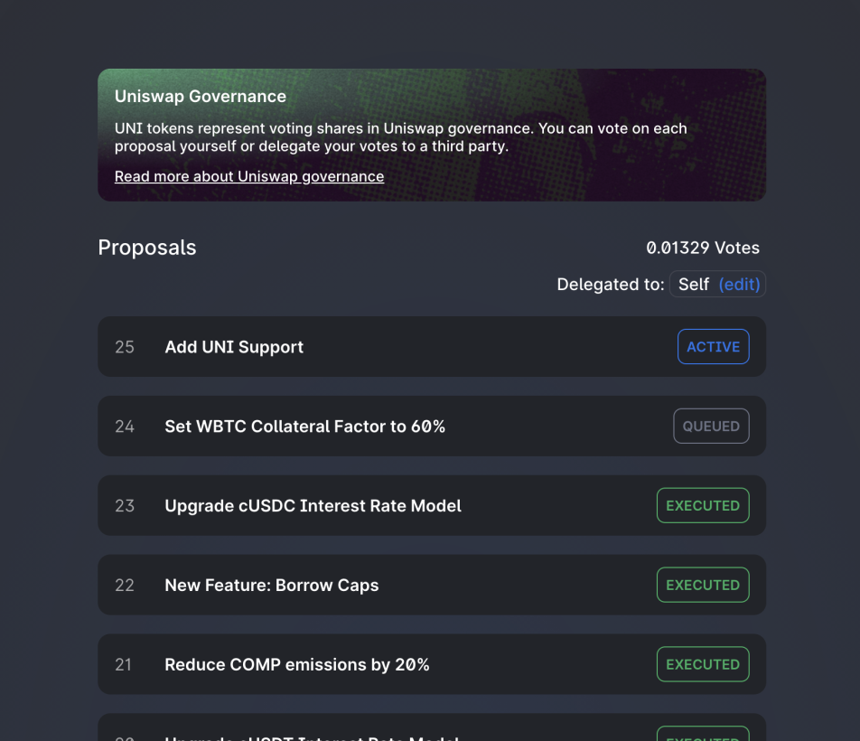
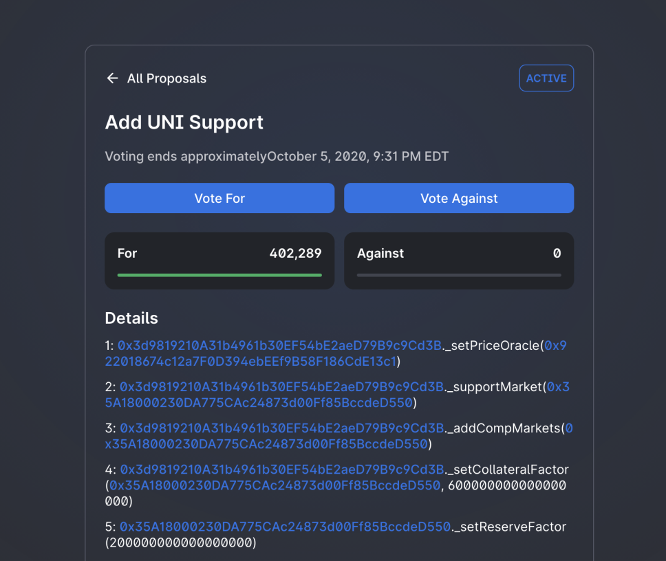
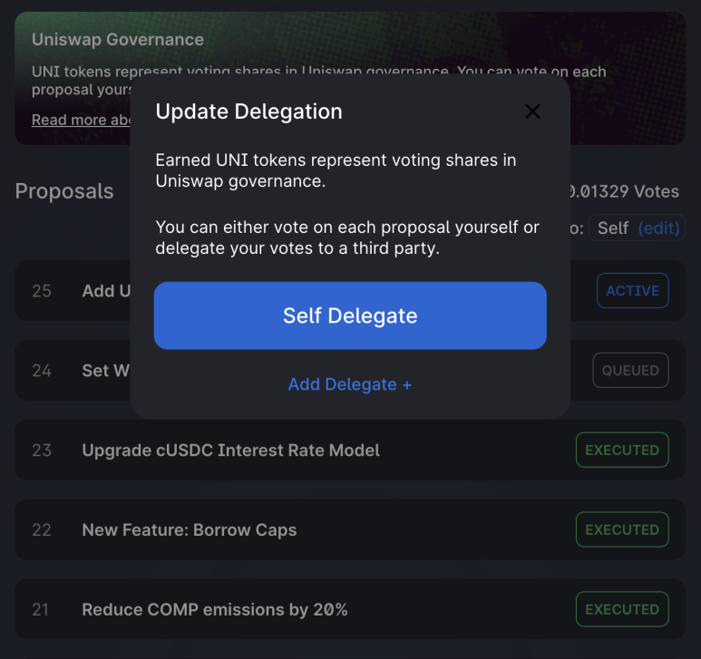
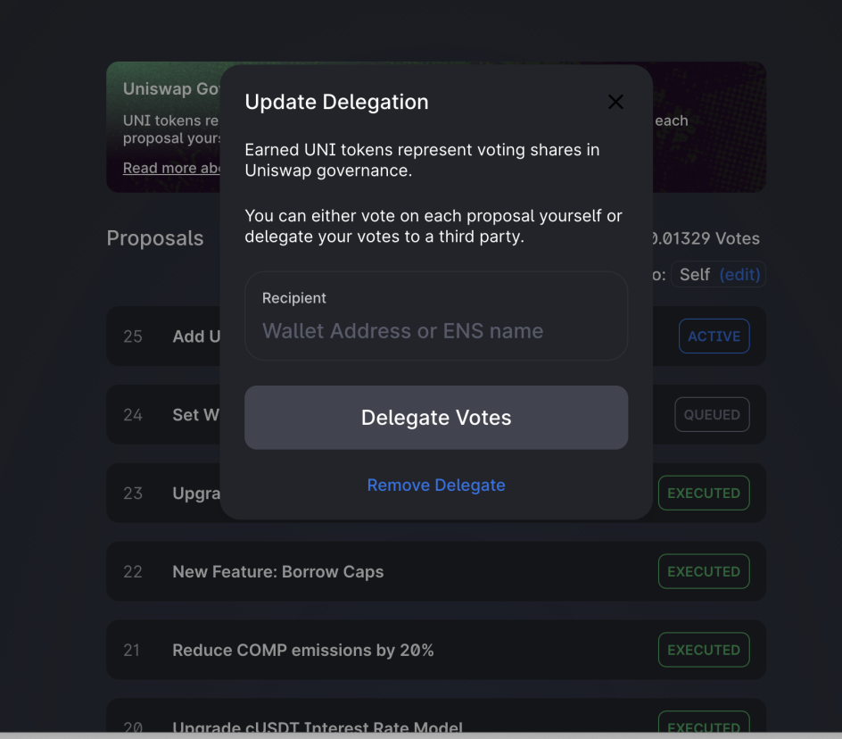
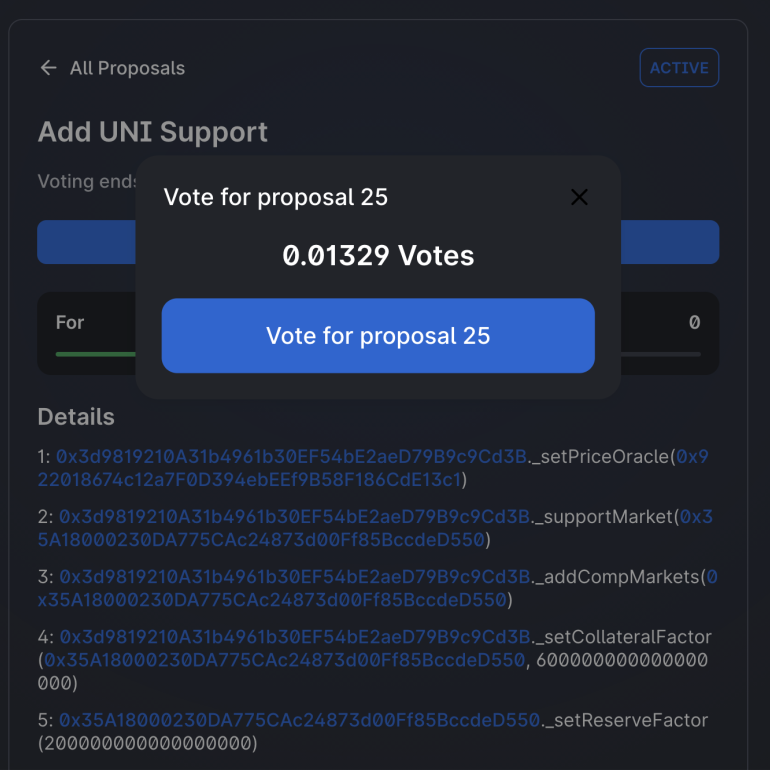
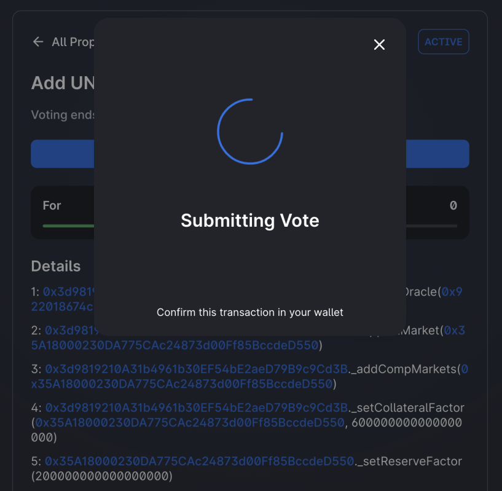

本指南包含了开始参与 Uniswap 治理投票所需的一切信息。

为了参与，您需要：

- [UNI 代币](https://uniswap.org/blog/uni/)
- 用于交易成本的 ETH
- 支持以太坊协议并持有 UNI 代币的加密钱包。如 [Uniswap 钱包](https://wallet.uniswap.org/)。
- 在投票开始前 [委托](#delegation) 您的代币。

治理 [流程](./02-process.md) 在 [治理论坛](https://gov.uniswap.org/) 开始，在这里您可以找到正在审议的提案、收集社区情绪的信息，并与社区互动。

一旦某个提案通过了提案流程并准备好进行投票，它将出现在 Uniswap [投票仪表板](https://app.uniswap.org/#/vote) 中 - 您可以在那里查看所有当前和过去的 Uniswap 提案。

如果一个提案正在进行投票，其标题旁边会显示 `active`。点击提案将显示所有必要的信息、文档和讨论，以帮助投票者做出明智的决定。

一旦提案进入投票阶段，它就代表了真实的、可执行的代码，将改变 Uniswap 治理或其管辖范围内任何事物的功能 - 应当采取适当的谨慎措施确保提案中所表示的代码已经过审计并且是出于善意的。

## 委托

UNI 是一种可交易资产，其功能类似于大多数其他标准 ERC20 代币，但作为投票机制具有更深层的力量。为了使 UNI 用作投票，所有者必须首先经过委托流程。委托 UNI 将您的代币投票权绑定到一个地址，以便可以用于投票。这个地址可能是您自己，或者是一个您信任的、相信会为 Uniswap 治理的最佳利益投票的第三方。

在我们的流程中，称为“法定人数”的民主共识由支持或反对提案的 UNI 代币百分比确定。提交提案必须有 1% 的所有 UNI 投赞成票，而要通过投票则需要 4% 的 UNI。

要委托您的 UNI 代币并激活其投票权，请访问 [Uniswap 投票仪表板](https://app.uniswap.org/#/vote)，然后点击标有“解锁投票”的按钮。

点击此按钮后，您将看到一个屏幕，允许您选择自我委托或添加委托地址。如果您希望将您的 UNI 投票权委托给自己的地址，请点击“自我委托”。

点击“自我委托”时，Metamask 中会出现一个交易。如果没有发生这种情况，请再次确认 Metamask 是否已连接到 app.uniswap.org，关闭任何弹出窗口阻止器，然后重试。点击确认，一旦交易处理完成，您会看到投票仪表板主页已更改，显示您拥有的票数以及“委托给：自我”。

如果您想将投票权委托给另一方，请选择“添加委托”，并输入您选择的投票方的以太坊地址。

重要说明：与更大规模民主中的选民登记类似，UNI 要用于投票，必须在投票期及其之前的提案期之前委托。这意味着如果您希望您的投票被计算在内，您必须提前委托，以期待您可能感兴趣的任何提案。

如果您不确定如何投票，并有兴趣将您的 UNI 投票权委托给另一方，您可以访问治理论坛的 [委托提案](https://gov.uniswap.org/c/delegation-pitch/6) 部分。在这里，参与 Uniswap 治理的各方会提出他们的平台和投票议程供用户阅读和讨论。

## 投票

如果您已成功进行自我委托且存在活跃提案，那么您已准备好在 Uniswap 治理中投票。

要投出您的选票，请导航至提案页面并点击一个活跃提案。

在审查了相关详细信息并决定了您的观点后，选择“投票支持”或“投票反对”。

选择后，将弹出一个窗口，允许您执行投票。

当您点击投出您的选票时，Metamask 将弹出要求您确认交易。点击“提交”，稍等片刻，然后检查交易是否已被确认。

就这样！一旦您的交易得到确认，您就已经投出了选票，参与了 Uniswap 治理。