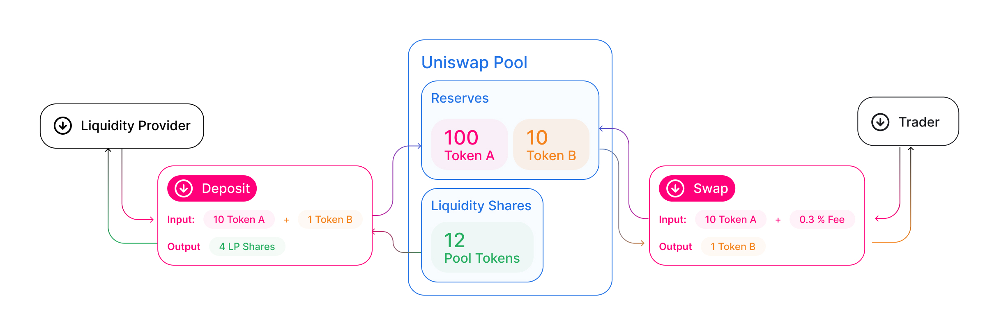
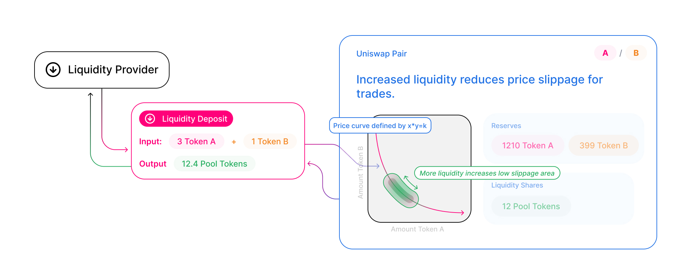

Uniswap 是一个由 [常数乘积公式](../protocol-overview/glossary#constant-product-formula) 驱动的 _自动化流动性协议_，并在不可升级的智能合约系统中实现，运行于 [以太坊](https://ethereum.org/) 区块链上。它消除了对可信中介的需求，优先考虑 **去中心化**、**抗审查性** 和 **安全性**。Uniswap 是 **开源软件**，根据 [GPL](https://en.wikipedia.org/wiki/GNU_General_Public_License) 许可。

每个 Uniswap 智能合约，或称为一对，管理着由两种 [ERC-20](https://eips.ethereum.org/EIPS/eip-20) 代币组成的流动性池。

任何用户都可以通过存入等值的每种基础代币来成为流动性提供者（LP），以此换取池子代币。这些代币追踪相对于总储备量的 LP 份额，并且可以随时兑换为底层资产。

对子充当自动做市商，只要保持“常数乘积”公式的不变，就随时准备接受一种代币以换取另一种。这个公式，最简单地表达为 `x * y = k`，表明交易不能改变一对储备余额（`x` 和 `y`）的乘积（`k`）。由于 `k` 在交易的参照系中保持不变，因此通常被称为不变量。此公式具有一个理想的特性，即相对于储备量而言，较大的交易执行的汇率远差于较小的交易。

在实践中，Uniswap 对交易应用了 0.30% 的手续费，该费用被添加到储备中。结果，每次交易实际上都增加了 `k`。这相当于向 LP 支付收益，当他们销毁自己的池子代币提取其占总储备比例的份额时，收益得以实现。未来，该手续费可能会降至 0.25%，剩余的 0.05% 将作为全网范围的费用扣留。

由于一对资产之间的相对价格只能通过交易改变，因此 Uniswap 价格与外部价格的偏差会创造套利机会。这一机制确保 Uniswap 价格始终趋向于市场出清价格。

# 进一步阅读

要了解代币交换在实践中的运作方式，并跟踪交换的生命周期，请参阅 [交换](../core-concepts/swaps)。或者，要了解流动性池的工作原理，请参见 [池子](../core-concepts/pools)。

当然，归根结底，Uniswap 协议只是在以太坊上运行的智能合约代码。要理解它们如何工作，请前往 [智能合约](../../reference/smart-contracts/factory)。