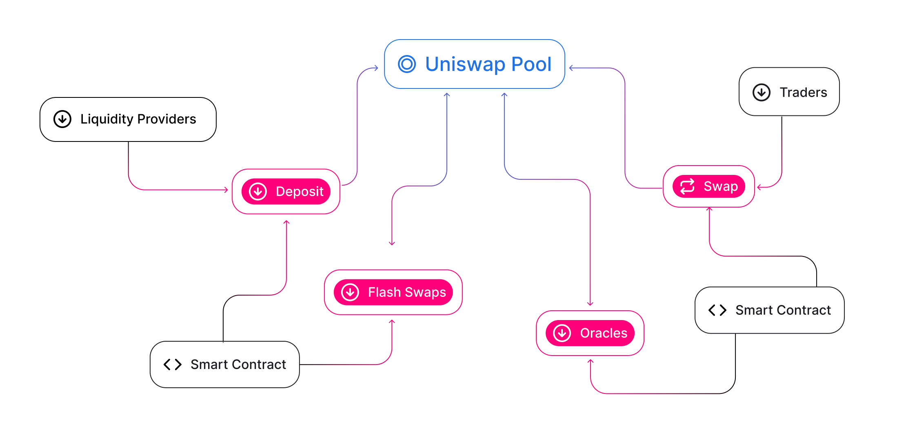

Uniswap 生态系统主要由三类用户组成：流动性提供者、交易者和开发者。流动性提供者受到激励，向通用的流动性池贡献 [ERC-20](https://eips.ethereum.org/EIPS/eip-20) 代币。交易者可以以固定的 [0.30% 手续费](../advanced-topics/fees)（归流动性提供者所有）互换这些代币。开发者可以直接与 Uniswap 智能合约集成，为新的和令人兴奋的代币交互、交易平台、零售体验等提供动力。

总体而言，这些类别之间的互动形成了正反馈循环，通过定义一个通用语言来汇集、交易和使用代币，推动了数字经济的发展。

# 流动性提供者

流动性提供者，或称为 LP，不是一个同质化的群体：

- 被动 LP 是希望被动投资其资产以累积交易费用的代币持有者。

- 专业 LP 将做市作为其主要策略。他们通常开发自定义工具和方法，跟踪他们在不同 DeFi 项目中的流动性头寸。

- 有时，代币项目选择成为 LP，以为其代币创建一个流动性市场。这使得代币买卖更加容易，并通过 Uniswap 解锁与其他 DeFi 项目的互操作性。

- 最后，一些 DeFi 先驱正在探索复杂的流动性提供互动，如激励性流动性、流动性作为抵押品，以及其他实验性策略。Uniswap 是项目尝试这类想法的理想协议。

# 交易者

协议生态系统中有几种类型的交易者：

- 投机者使用社区构建的各种工具和产品，利用从 Uniswap 协议中提取的流动性交换代币。

- 套利机器人通过比较不同平台上的价格寻找优势来寻求利润。（尽管看起来像是剥削，但这些机器人实际上有助于在更广泛的以太坊市场上均衡价格，保持公平。）

- DAPP 用户在 Uniswap 上购买代币，用于以太坊上的其他应用程序。

- 实现交换功能的智能合同（从 DEX 聚合器到自定义 Solidity 脚本的产品）在协议上执行交易。

在所有情况下，交易都需支付相同的固定费用，以在协议上进行交易。每个对提高价格准确性和激励流动性都至关重要。

# 开发者/项目

Uniswap 在更广泛的以太坊生态系统中使用的方式太多，无法一一列举，但一些例子包括：

- Uniswap 的开源和可访问性质意味着有无数的 UX 实验和前端构建，以提供对 Uniswap 功能的访问。你可以在大多数主要的 DeFi 仪表板项目中找到 Uniswap 功能。社区还构建了许多 [Uniswap 特定工具](https://github.com/Uniswap/universe)。

- 钱包经常将交换和流动性提供功能整合为其产品的核心服务。

- DEX（去中心化交易所）聚合器从多个流动性协议中提取流动性，通过拆分交易为交易者提供最佳价格。对于这些项目，Uniswap 是最大的单一去中心化流动性来源。

- 智能合约开发者利用可用的一系列功能来发明新的 DeFi 工具和其他各种实验性想法。看看像 [Unisocks](https://unisocks.exchange/) 或 [Zora](https://ourzora.com/) 这样的项目，还有许多其他项目。

# Uniswap 团队和社区

Uniswap 团队以及更广泛的 Uniswap 社区推动着协议和生态系统的开发。