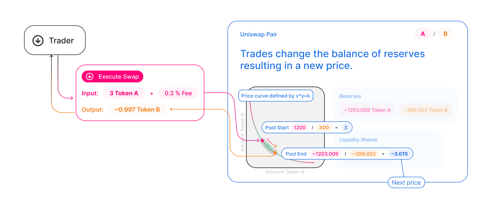

# 引言

在 Uniswap 中，代币交换是一种简单的方式，可以将一种 ERC-20 代币换成另一种。

对于终端用户而言，交换直观易懂：用户选择输入代币和输出代币。他们指定输入数量，协议计算他们将收到多少输出代币。然后，他们只需点击一下即可执行交换，并立即在他们的钱包中接收输出代币。

在这份指南中，我们将探讨在协议层面交换时发生的事情，以更深入地理解 Uniswap 的工作原理。

Uniswap 中的交换与传统平台上的交易不同。Uniswap 不使用订单簿来表示流动性或确定价格。Uniswap 使用自动做市商机制来即时反馈汇率和滑点。

正如我们在 [协议概览](../protocol-overview/how-uniswap-works) 中所学到的，Uniswap 上的每对代币实际上都由一个流动性池支撑。流动性池是智能合约，持有两种独特代币的余额，并强制执行围绕存入和提取它们的规则。

这个规则就是 [常数乘积公式](../protocol-overview/glossary#constant-product-formula)。当任何一种代币被提取（购买）时，必须按比例存入另一种代币（卖出），以保持常数不变。

## 交换的构成

在最基本的层面上，所有 Uniswap V2 中的交换都在一个名为 `swap` 的单一函数中发生：

```solidity
function swap(uint amount0Out, uint amount1Out, address to, bytes calldata data);
```

# 接收代币

从函数签名中可能已经很清楚，Uniswap 要求 `swap` 调用者通过 `amount{0,1}Out` 参数 _指定他们希望接收多少输出代币_ ，这些参数对应于 `token{0,1}` 的期望数量。

# 发送代币

不太明显的是 Uniswap 如何 _接收_ 作为交换支付的代币。通常，需要代币执行某些功能的智能合约要求调用者首先在代币合约上进行批准，然后调用一个反过来在代币合约上调用 transferFrom 的函数。这 _不是_ V2 对如何接受代币的方式。相反，对在每次交互 _结束时_ 检查其代币余额。然后，在下一次交互 _开始_ 时，当前余额与存储的值进行对比，以确定当前交互者发送的代币数量。请参阅 <a href='/whitepaper.pdf' rel='noopener noreferrer'>白皮书</a> 了解为何会是这种情况的解释。

要点是 **在调用 swap 之前必须将代币转移到对** （该规则的一个例外是 [闪兑](flash-swaps)）。这意味着为了安全地使用 `swap` 函数，它必须从 _另一个智能合约_ 调用。替代方案（先将代币转移到对，然后再调用 `swap`）并非原子操作，因此不安全，因为发送的代币将容易受到套利攻击。

# 开发资源

- 要了解如何在智能合约中实现代币交换，请阅读 [从智能合约交易](../../guides/smart-contract-integration/trading-from-a-smart-contract)。
- 要了解如何从界面执行交换，请阅读 [交易（SDK）](../../../../sdk/2.0.0/guides/trading)。