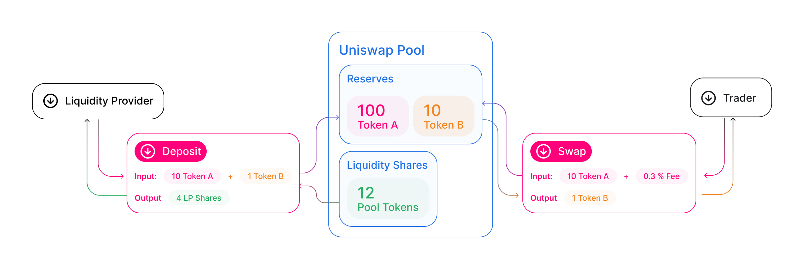

# 引言

每个 Uniswap 流动性池都是用于一对 ERC20 代币的交易场所。当创建池合约时，每种代币的余额为 0；为了使池开始促进交易，必须有人用每种代币的初始存款来启动它。这第一个流动性提供者是设定池初始价格的人。他们被激励向池中存入两种代币相等的价值。让我们来看看为什么，考虑一下第一个流动性提供者以不同于当前市场汇率的比例存入代币的情况。这立即创造了一个有利可图的套利机会，很可能被外部方利用。

当其他流动性提供者向现有池添加资金时，他们必须按当前价格存入成比例的代币对。如果他们不这样做，他们添加的流动性也有可能被套利。如果他们认为当前的价格不正确，他们可以将价格套利到他们希望的水平，并在该价格下增加流动性。

# 池代币

每当有流动性存入池中时，都会铸造出独特的代币，称为“流动性代币”，并发送到提供者的地址。这些代币代表特定流动性提供者对池的贡献。提供者提供的池流动性比例决定了他们收到的流动性代币数量。如果提供者正在铸造一个新的池，他们将收到的流动性代币数量将等于 sqrt(x * y)，其中 x 和 y 分别代表提供的每种代币的数量。

每当发生交易时，会向交易发送者收取 0.3% 的费用。这笔费用在交易完成后按照持有比例分配给池中的所有 LP（流动性提供者）。

为了取回底层流动性以及任何已累积的费用，流动性提供者必须“销毁”他们的流动性代币，实际上是以它们交换他们在流动性池中的份额，加上相应的费用分配。

由于流动性代币本身是可交易资产，流动性提供者可以自由出售、转让或以任何他们认为合适的方式使用其流动性代币。

> 通过高级主题了解更多：

- [理解回报](../../concepts/advanced-topics/understanding-returns)
- [费用](../../concepts/advanced-topics/fees)

# 为什么是池？

Uniswap 的独特之处在于，它不使用订单簿来确定资产的价格或匹配代币的买卖双方。相反，Uniswap 使用所谓的流动性池。

流动性通常由个人在中心化运营的订单簿上放置的离散订单表示。寻求提供流动性的参与者或做市商必须积极管理他们的订单，持续根据市场中其他人的活动更新订单。

虽然订单簿是金融的基础，对于某些用途非常有效，但它们存在一些重要的局限性，在应用于去中心化或区块链原生设置时尤其突出。订单簿需要中间基础设施来托管订单簿和匹配订单。这产生了控制点，并增加了额外的复杂层次。它们还需要做市商的积极参与和管理，而做市商通常使用复杂的基础设施和算法，这限制了参与者的范围，只限于高级交易者。订单簿是在相对较少的资产被交易的世界中发明的，所以它们并不适合一个任何人都可以创建自己代币的生态系统，而这些代币通常具有低流动性。总的来说，考虑到像以太坊这样的平台提供的基础设施权衡，订单簿并不是在区块链上实现流动性协议的原生架构。

Uniswap 致力于利用以太坊的优势，从第一原则重新构想代币互换。

一个区块链原生的流动性协议应该利用可信的代码执行环境、自主且永久运行的虚拟机以及产生指数级增长的虚拟资产生态系统的开放、无需许可和包容性访问模型。

重要的是要重申，一个池就是一个智能合约，由用户调用其上的函数来操作。交换代币是在池合约实例上调用 `swap`，而提供流动性是在调用 `deposit`。

就像最终用户可以通过界面与 Uniswap 协议交互（该界面反过来与底层合约交互），开发者可以直接与智能合约交互，并将 Uniswap 功能集成到他们自己的应用程序中，而不依赖于中间人或需要权限。

# 开发者资源

- 要了解如何在智能合约中池化代币，请阅读[提供流动性](../../guides/smart-contract-integration/providing-liquidity)。