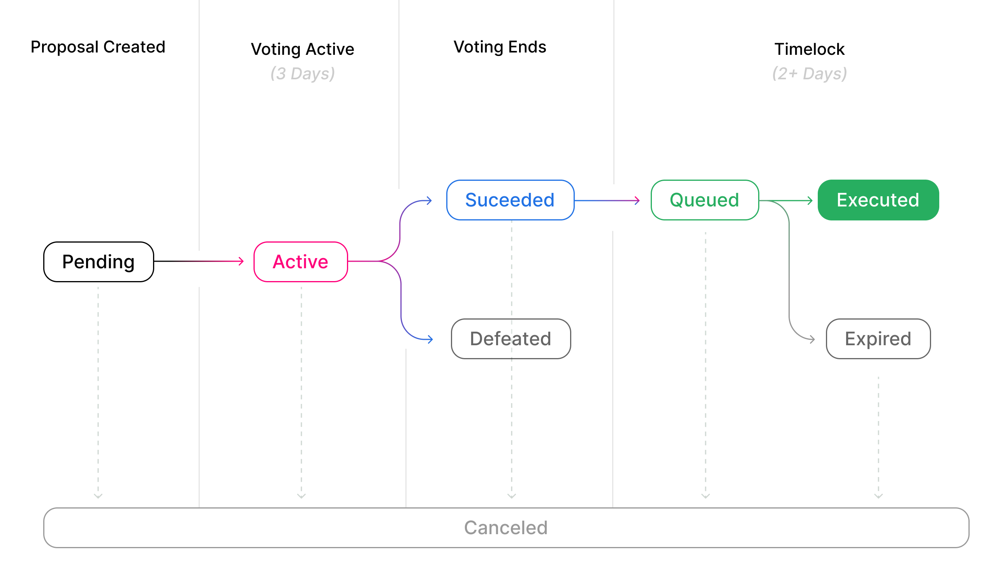

> 针对新部署的 Governor Bravo 的更新参考文档可通过 [Etherscan](https://etherscan.io/address/0x408ED6354d4973f66138C91495F2f2FCbd8724C3) 获得，以下部分参考资料可能已过时。

Uniswap 协议由 UNI 代币持有者治理和升级，使用三个不同的组件：UNI 代币、治理模块和时间锁。这些合约共同使社区能够提议、投票并实施对 Uniswap 协议的更改。

任何拥有超过 250 万 UNI 委托的地址都可以提出治理行动，其中包含已完成的可执行代码。当提案创建后，在三天的投票期间，社区可以投出他们的选票。如果多数支持，并且至少有 400 万张选票投给提案，则提案将在时间锁中排队，并可在最少两天后执行。

## 时间锁

时间锁合约可以以“时间延迟，可选择退出”的升级模式修改系统参数、逻辑和合约。时间锁有一个硬编码的最小延迟为两天，这是治理行动可能发出的最短通知时间。每个提议的行动将在公告发布后的至少两天未来公布。重大升级，如改变风险系统，可能有多达 30 天的延迟。时间锁受治理模块控制；待处理和已完成的治理行动可以在时间锁仪表板上进行监控。



# 关键事件

## DelegateChanged

```solidity
DelegateChanged(address indexed delegator, address indexed fromDelegate, address indexed toDelegate)
```

当账户更改其委托人时触发。

## DelegateVotesChanged

```solidity
DelegateVotesChanged(address indexed delegate, uint previousBalance, uint newBalance)
```

当委托账户的投票余额发生变化时触发。

## ProposalCreated

```solidity
ProposalCreated(uint id, address proposer, address[] targets, uint[] values, string[] signatures, bytes[] calldatas, uint startBlock, uint endBlock, string description)
```

当创建新的提案时触发。

## VoteCast

```solidity
VoteCast(address voter, uint proposalId, bool support, uint votes)
```

当提案上已投出一票时触发。

## ProposalCanceled

```solidity
ProposalCanceled(uint id)
```

当提案被取消时触发。

## ProposalQueued

```solidity
ProposalQueued(uint id, uint eta)
```

当提案在时间锁中排队时触发。

## ProposalExecuted

```solidity
ProposalExecuted(uint id)
```

当提案在时间锁中执行时触发。

# 只读函数：UNI

## 获取当前投票数

```solidity
function getCurrentVotes(address account) returns (uint96)
```

返回账户在当前区块的投票余额。

| 名称     | 类型      | 描述                                                         |
| -------- | --------- | ------------------------------------------------------------ |
| account  | `address` | 获取投票数量的账户地址。                                     |

## 获取先前投票数

```solidity
function getPriorVotes(address account, uint blockNumber) returns (uint96)
```

返回账户在特定区块号上的先前投票数。传递的区块号必须是一个已确认的区块，否则函数将回退。

| 名称        | 类型      | 描述                                                         |
| ----------- | --------- | ------------------------------------------------------------ |
| account     | `address` | 获取先前投票数的账户地址。                                   |
| blocknumber | `uint`    | 获取先前投票数的区块号。                                     |
|             |           |                                                              |
| unnamed     | `uint96`  | 先前的投票数                                                 |

# 状态更改函数：UNI

## 委托

```solidity
function delegate(address delegatee)
```

从发送者向委托人委派投票。用户每次可以向一个地址委派，而添加到委托人的投票计数中的投票数相当于用户账户中的 UNI 余额。投票从当前区块开始委派，直到发送者再次委派或转移他们的 UNI。

| 名称      | 类型      | 描述                                                         |
| --------- | --------- | ------------------------------------------------------------ |
| delegatee | `address` | 发送者希望将其投票委托给的地址。                             |

## 通过签名委派

```solidity
function delegateBySig(address delegatee, uint nonce, uint expiry, uint8 v, bytes32 r, bytes32 s)
```

从发送者向委托人委派投票。用户每次可以向一个地址委派，而添加到委托人的投票计数中的投票数相当于用户账户中的 UNI 余额。投票从当前区块开始委派，直到发送者再次委派或转移他们的 UNI。

| 名称      | 类型      | 描述                                                         |
| --------- | --------- | ------------------------------------------------------------ |
| delegatee | `address` | 发送者希望将其投票委托给的地址。                             |
| nonce     | `uint`    | 必须与签名匹配的合同状态。可以从合同的公共非重复映射中检索。 |
| expiry    | `uint`    | 签名过期的时间。自 Unix 时代以来的区块时间戳（秒）。         |
| v         | `uint`    | 签名的恢复字节。                                             |
| r         | `bytes32` | ECDSA 签名对的一半。                                         |
| s         | `bytes32` | ECDSA 签名对的一半。                                         |

# 只读函数：Governor Alpha

## 投票门槛

```solidity
function quorumVotes() public pure returns (uint)
```

返回提案成功所需的最低投票数。

## 提案门槛

```solidity
function proposalThreshold() returns (uint)
```

返回账户创建提案所需的最低投票数。

## 提案最大操作数

```solidity
function proposalMaxOperations() returns (uint)
```

返回提案中可以包含的最大操作数。操作是在提案成功并执行时将要调用的函数调用。

## 投票延迟

```solidity
function votingDelay() returns (uint)
```

返回在提案上开始投票前需要等待的区块数。这个值在创建提案时会加到当前区块号上。

## 投票期限

```solidity
function votingPeriod() returns (uint)
```

返回提案投票的持续时间，以区块为单位。

## 获取操作

```solidity
function getActions(uint proposalId) returns (uint proposalId) public view returns (address[] memory targets, uint[] memory values, string[] memory signatures, bytes[] memory calldatas)
```

获取选定提案的操作。传递一个提案 ID 并获取该提案的目标、值、签名和 calldatas。

| 名称       | 类型   | 描述                     |
| ---------- | ------ | ------------------------ |
| proposalId | `uint` | 提案的 ID                |

返回：

- 合约地址数组，提案调用的目标。
- 无符号整数数组，提案使用的值。
- 字符串数组，提案的签名。
- calldata 字节数组，提案的内容。

## 获取收据

```solidity
function getReceipt(uint proposalId, address voter) returns (Receipt memory)
```

返回给定投票者的提案选票收据。

| 名称       | 类型      | 描述                                                         |
| ---------- | --------- | ------------------------------------------------------------ |
| proposalId | `uint`    | 获取投票者选票收据的提案 ID。                                 |
| voter      | `address` | 提案投票者的账户地址。                                       |
|            |           |                                                              |
| Receipt    | `struct`  | 用于投票者地址的选票的 Receipt 结构。                         |

## 状态

```solidity
function state(uint proposalId) returns (ProposalState)
```

返回类型为 ProposalState 的枚举，可能的类型是：
- Pending（等待）
- Active（活动）
- Canceled（已取消）
- Defeated（失败）
- Succeeded（成功）
- Queued（已排队）
- Expired（已过期）
- Executed（已执行）

| 名称       | 类型   | 描述                     |
| ---------- | ------ | ------------------------ |
| proposalId | `uint` | 提案的 ID                |

# 状态更改函数：Governor Alpha

## 提案

```solidity
function propose(address[] memory targets, uint[] memory values, string[] memory signatures, bytes[] memory calldatas, string memory description) returns (uint)
```

创建一个改变协议的提案。

提案将由委托投票者投票。如果在投票期结束前有足够的支持，提案将自动生效。生效的提案将被排队并在时间锁合约中执行。

发送者必须在立即前一个区块持有的 UNI 多于当前提案门槛（proposalThreshold()）的值。提案最多可以有 10 个动作（基于 proposalMaxOperations()）。

提案者在当前有挂起或活动提案的情况下不能创建另一个提案。由于时间锁中的限制，不可能在同一区块中排队两个相同的操作，因此单个提案中的操作必须是唯一的，共享相同操作的不同提案必须在不同的区块中排队。

| 名称        | 类型      | 描述                                                         |
| ----------- | --------- | ------------------------------------------------------------ |
| targets     | `address` | 在提案执行期间将要调用的目标地址的有序列表。此数组的长度必须与此函数中所有其他数组参数相同。 |
| values      | `uint`    | 在提案执行期间将要传递给调用的值（即 msg.value）的有序列表。此数组的长度必须与此函数中所有其他数组参数相同 |
| signatures  | `string`  | 在执行期间将要传递的函数签名的有序列表。此数组的长度必须与此函数中所有其他数组参数相同。       |
| calldatas   | `bytes`   | 在提案执行期间将要传递给每个单独函数调用的数据的有序列表。此数组的长度必须与此函数中所有其他数组参数相同。 |
| description | `string`  | 提案的描述及其将实施的更改的人类可读描述。                   |
|             |           |                                                              |
| Unnamed     | `uint`    | 返回新提案的 ID                                              |

## 排队

```solidity
function queue(uint proposalId)
```

提案成功后，任何地址都可以调用 queue 方法将提案移入时间锁队列。只有成功的提案才能被排队。

| 名称       | 类型   | 描述                           |
| ---------- | ------ | ------------------------------ |
| proposalId | `uint` | 给定的成功提案的 ID             |

## 执行

```solidity
function execute(uint proposalId) payable
```

时间锁延迟期过后，任何账户都可以调用 execute 方法将提案中的更改应用到目标合约上。这将调用提案中描述的每一个动作。
此函数是可以支付的，以便时间锁合约可以调用提案中选择的可支付函数。

| 名称       | 类型   | 描述                           |
| ---------- | ------ | ------------------------------ |
| proposalId | `uint` | 给定的成功提案的 ID             |

## 取消

```solidity
function queue(uint proposalId)
```

取消尚未执行的提案。守护者是唯一可以执行此操作的人，除非提案者没有维持创建提案所需的委托。如果提案者拥有的委托少于提案门槛，任何人都可以取消提案。

| 名称       | 类型   | 描述                   |
| ---------- | ------ | ---------------------- |
| proposalId | `uint` | 要取消的提案的 ID       |

## 投票

```solidity
function castVote(uint proposalId, bool support)
```

对提案投票。账户的投票权重由提案变为活动时的委托投票数决定。

| 名称       | 类型   | 描述                                                         |
| ---------- | ------ | ------------------------------------------------------------ |
| proposalId | `uint` | 给定的成功提案的 ID                                           |
| support    | `bool` | 对提案投票的“是”或“否”，真表示“是”，假表示“否”。         |

## 通过签名投票

```solidity
function castVoteBySig(uint proposalId, bool support, uint8 v, bytes32 r, bytes32 s)
```

对提案投票。账户的投票权重由提案变为活动时的委托投票数决定。此方法与 Cast Vote 目的相同，但允许离线签名参与治理投票。有关如何创建离线签名的更多详细信息，请参阅 EIP-712。

| 名称       | 类型      | 描述                                                         |
| ---------- | --------- | ------------------------------------------------------------ |
| proposalId | `uint`    | 给定的成功提案的 ID                                           |
| support    | `bool`    | 对提案投票的“是”或“否”，真表示“是”，假表示“否”。         |
| expiry     | `uint`    | 签名过期的时间。自 Unix 时代以来的区块时间戳（秒）。         |
| v          | `uint`    | 签名的恢复字节。                                             |
| r          | `bytes32` | ECDSA 签名对的一半。                                         |
| s          | `bytes32` | ECDSA 签名对的一半。                                         |