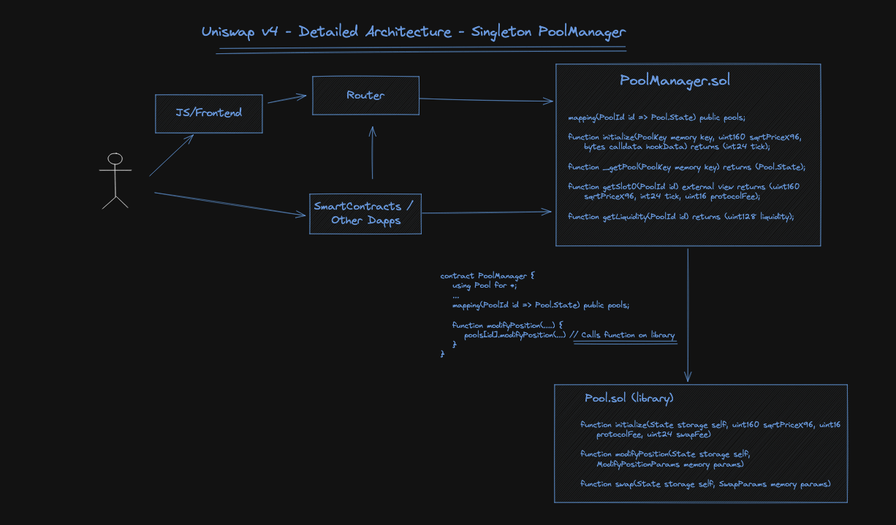

# 架构
在 Uniswap V3 中，每个资金池都有自己的合约实例，这使得初始化资金池和在多个资金池中进行交换成本高昂。
而在 V4 中，所有资金池都保存在一个单一的合约中，从而提供了大量的燃气费节省。

初步计算表明，V4 将使创建资金池的燃气成本降低 99%。挂钩提供无限的选择，而单个合约让你能够轻松地
浏览所有这些选择。

这种单例设计通过一种新的“闪存会计”方法得到增强。与 V3 中每次交换后资金进出资金池不同，这种方法仅移动净余额。这意味着系统效率更高，
在 Uniswap V4 中节省了更多的燃气费用。

由于单例合约和闪存会计的高效性，没有必要限制费用层级。创建资金池的人可以自由选择它们以保持竞争力或使用动态费用挂钩更改它们。V4 还再次支持
原生 ETH，这有助于节省更多燃气费用。