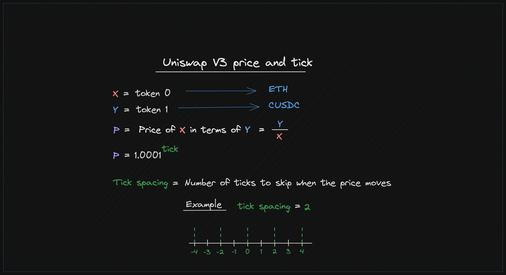
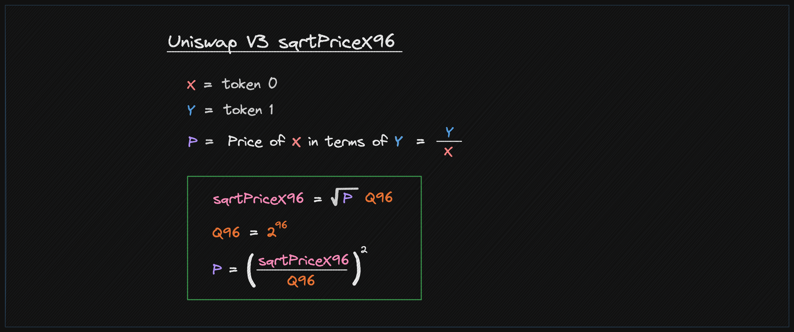
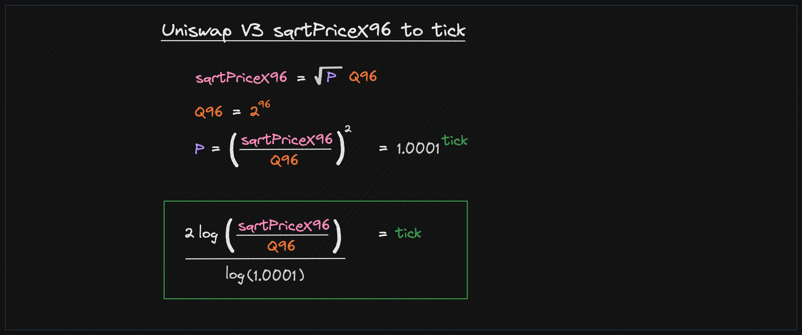

# 仓位
要添加或移除代币，我们调用在`PoolManager.sol`文件中定义的`modifyPosition`函数。

```solidity
struct ModifyPositionParams {
   // 仓位的下界和上界tick
   int24 tickLower;
   int24 tickUpper;
   // 如何修改流动性
   int256 liquidityDelta;
}

/// @notice 修改给定池的仓位
function modifyPosition(PoolKey memory key, ModifyPositionParams memory params, bytes calldata hookData)
external
returns (BalanceDelta);
```

# 重要概念
在使用Uniswap V3或V4仓位时，需要理解的一些重要概念包括：

1. Tick
2. Tick间距
3. SquareRoot价格X96
4. 流动性增量

### Tick
`tick`是本代码中用于以独特方式处理两种不同资产（代币）价格的度量。一个`tick`
代表了这两种资产之间特定的价格比率，通过数学公式计算得出。



代码中定义了最小和最大`tick`值，确保计算出的价格在
合理的、可接受的范围内。

在Uniswap V3（和V4）中，流动性提供者可以在特定价格范围（ticks）内提供流动性，使他们能够
集中他们的流动性，从而可能赚取更多费用。

每个tick对应一个特定的价格，并非所有价格都得到表示，这是由于ticks的离散性质。

### Tick间距
Tick间距是一个参数，决定了这些可用tick之间的分离，只让每
N个tick可用于流动性提供，其中`N`是tick间距。这是对
可以提供流动性的价格水平的一种量化。

### SquareRoot价格X96
在Uniswap V3（和V4）中，平方根价格(`sqrtPriceX96`)是一个核心概念，也是数学
计算的关键部分。它被用于各种计算，包括确定在交换过程中应移动的代币数量以及在特定价格范围内进行的
流动性计算。

以下是`sqrPriceX96`所代表的内容的分解：

### 1. **平方根价格：**
价格以两个代币实际价格比的平方根形式表示。这种表示
简化了数学运算，特别是在计算要交换的数量以及
在tick范围内进行的流动性计算时尤其如此。

### 2. **X96：**
X96后缀指的是使用的定点格式。Uniswap V3使用96位定点数格式。
在这种表示中，有维持高精度计算的惯例。定点
表示意味着实际浮点数乘以\(2^{96}\)并作为整数存储。读取该值时，必须通过将其除以\(2^{96}\)来正确解释，以获得
实际值。



### SqrtPriceX96到Tick转换
既然`tick`和`sqrPriceX96`都是价格的表现形式，它们可以相互转换。

Uniswap V3/V4核心库提供了两个函数来转换这两种表示：

https://github.com/Uniswap/v4-core/blob/main/src/libraries/TickMath.sol

1. 函数`getSqrtRatioAtTick`接受一个`tick`值作为输入，并计算在该特定`tick`下的两种资产的价格比率的平方根。结果表示在特定状态或位置下两种
资产之间的价格关系。

2. `getTickAtSqrtRatio`函数则相反——它接受一个价格比率的平方根，并计算
对应的`tick`。这个`tick`值代表了一种状态，在这种状态下，资产具有给定的
价格关系。



### 流动性增量
`liquidityDelta`是仓位中当前流动性与所需流动性之间的差额。它可以
为正（当你正在增加流动性时），或者为负（当你正在移除流动性）。

以下是来自Uniswap V3合约的代码，用于计算流动性（或liquidityDelta）：

https://github.com/Uniswap/v3-periphery/blob/main/contracts/base/LiquidityManagement.sol

```solidity
   (uint160 sqrtPriceX96, , , , , , ) = pool.slot0();
   uint160 sqrtRatioAX96 = TickMath.getSqrtRatioAtTick(params.tickLower);
   uint160 sqrtRatioBX96 = TickMath.getSqrtRatioAtTick(params.tickUpper);

   liquidity = LiquidityAmounts.getLiquidityForAmounts(
       sqrtPriceX96,
       sqrtRatioAX96,
       sqrtRatioBX96,
       params.amount0Desired,
       params.amount1Desired
   );
```

# 示例 - 添加流动性
以下代码将流动性添加到一个仓位
```solidity
int24 tickLower = -600;
int24 tickUpper = 600;
uint256 liquidity = 1e18;

PoolManager manager = new PoolManager(500000);
// 用于与池交互的帮助器
PoolModifyPositionTest modifyPositionRouter = new PoolModifyPositionTest(IPoolManager(address(manager)));

modifyPositionRouter.modifyPosition(
    poolKey,
    IPoolManager.ModifyPositionParams({
        tickLower: tickLower,
        tickUpper: tickUpper,
        liquidityDelta: int256(liquidity)
    }),
    ZERO_BYTES
);
```
注：`PoolModifyPositionTest`实现了`ILockCallback`接口，并添加了`lockAcquired`函数，该函数反过来调用`manager.modifyPosition`函数。

# 获取锁
关于锁定机制的完整细节在[锁定机制](/03_Locking_Mechanism/README.md)部分中有详细说明。

调用`modifyPosition`的合约必须实现ILockCallback接口。

PoolModifyPositionTest.sol包含了一些如何获取锁和一些基本检查的例子。
https://github.com/Uniswap/v4-core/blob/main/src/test/PoolModifyPositionTest.sol

在`PoolModifyPositionTest`中，当锁被获取时，执行`lockAcquired`函数，处理
余额调整以及与外部货币和合约的交互。该函数接受原始
编码数据作为输入，然后将其解码为结构化数据，具体为`CallbackData`。进行必要的验证和检查，确保调用该函数的是管理器，并处理
诸如结算金额和根据条件（如金额是否为正或负）进行必要转账等修改。